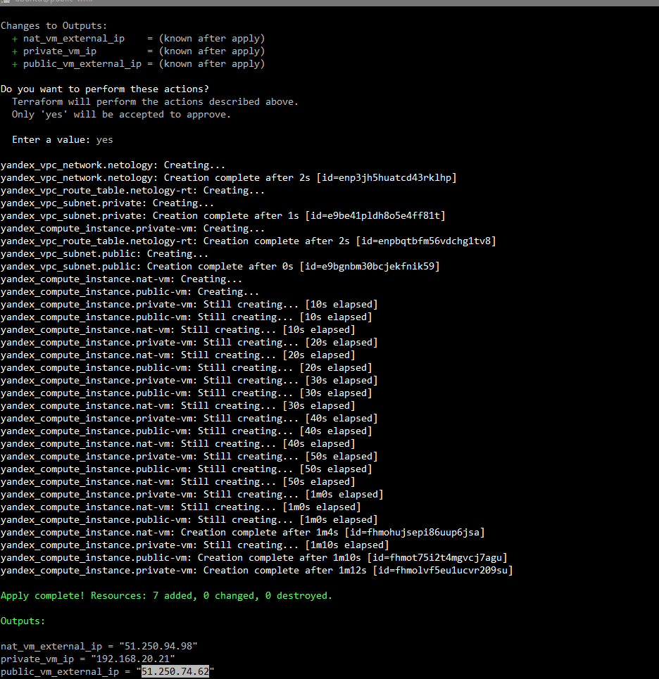
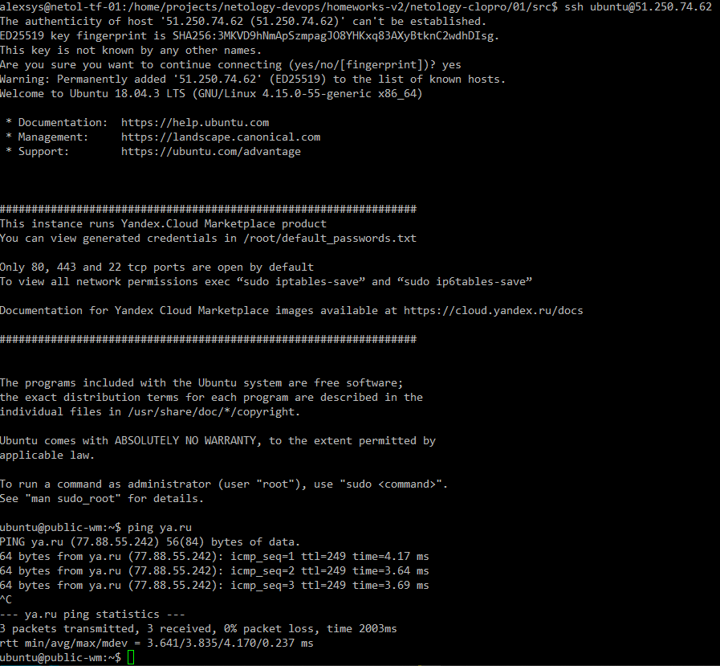
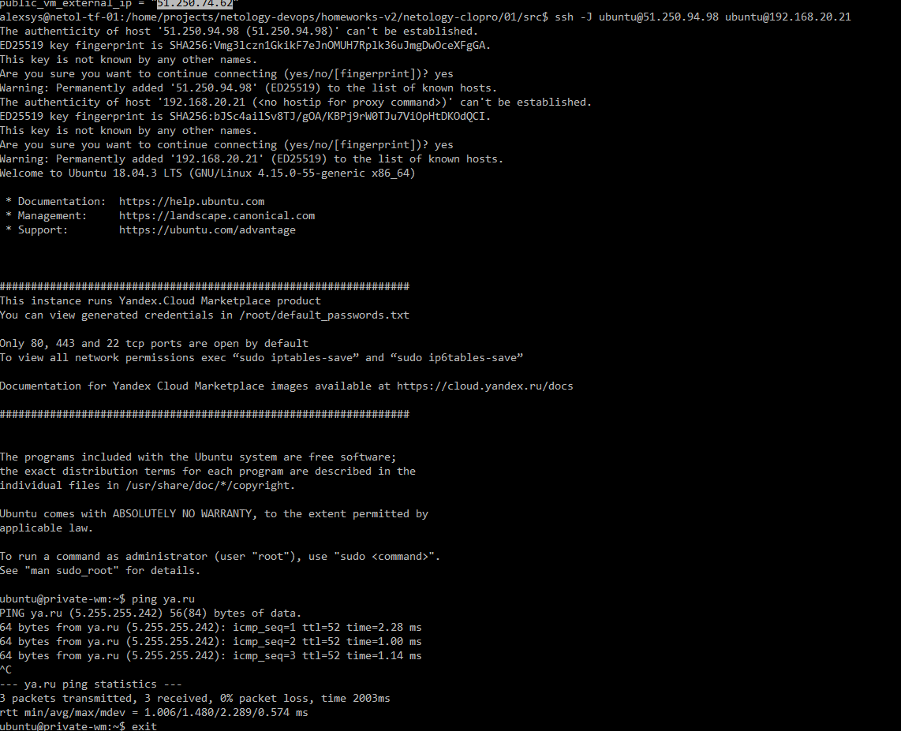

# 01. Организация сети

### 1. Создаём сеть, публичную подсеть, приватную подсеть и привязанную к ней таблицу маршрутизации: 
```terraform
resource "yandex_vpc_network" "netology" {
  name = var.vpc_name
}

resource "yandex_vpc_subnet" "public" {
  name           = var.pub_name
  zone           = var.default_zone
  network_id     = yandex_vpc_network.netology.id
  v4_cidr_blocks = var.pub_cidr

}

resource "yandex_vpc_subnet" "private" {
  name           = var.pvt_name
  zone           = var.default_zone
  network_id     = yandex_vpc_network.netology.id
  v4_cidr_blocks = var.pvt_cidr
  route_table_id = yandex_vpc_route_table.netology-rt.id
}

# Routing table
resource "yandex_vpc_route_table" "netology-rt" {
  name       = var.rt_name
  network_id = yandex_vpc_network.netology.id
  static_route {
    destination_prefix = var.rt_prefix
    next_hop_address   = var.rt_gateway
  }
}
```

### 2. Создаём три ВМ: NAT-шлюз, ВМ в публичной сети и ВМ в приватной сети без включенной опции NAT
 
См. основной файл конфигурфции [main.tf](src/main.tf)
        
Проверяем:



Проверяем публичную машину:



Проверяем машину в приватной сети, подключаясь к ней через шлюз:



Файлы конфигурации расположены в каталоге [src](src/)

