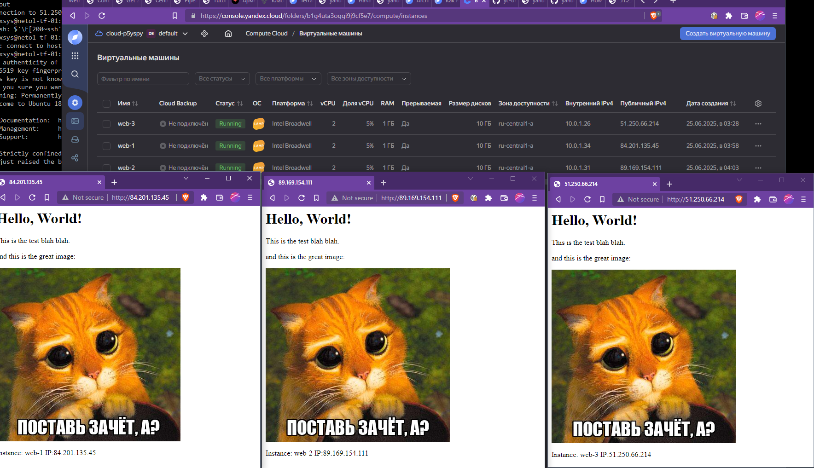

# 01. Вычислительные мощности. Балансировщики нагрузки

### 1. Создаём два ресурса для bucket и файла:
```terraform
resource "yandex_storage_bucket" "test_bucket" {
  bucket = var.s3_bucket_name
  folder_id = var.folder_id
  anonymous_access_flags {
    read = var.s3_anon_read
    list = var.s3_anon_list
  }
}

resource "yandex_storage_object" "image_file" {
  depends_on = [yandex_storage_bucket.test_bucket]
  bucket = var.s3_bucket_name
  key    = var.s3_file_key
  source = var.s3_file_path

}
```

Проверяем:


### 2. Создаём группу ВМ
Создаём все необходимые ресурсы и группу yandex_compute_instance_group с шаблоном ВМ на основе образа LAMP,
которому через cloud-init передаём простой файл `index.html` со ссылкой на нашу картинку:

```yaml
#cloud-config
users:
  - name: ${username}
    groups: sudo
    shell: /bin/bash
    sudo: ["ALL=(ALL) NOPASSWD:ALL"]
    ssh_authorized_keys:
      - ${ssh_public_key}

write_files:
  - path: /var/www/html/index.html
    content: |
      <html>
      <body>
        <h1>Hello, World!</h1>
        <p>This is the test blah blah.</p>
        <p>and this is the great image:</p>
        </img>
        <p>Instance: #hostname# IP:#public_ip#</p>
      </body>
      </html>
    owner: 'root:root'
    permissions: '0644'

runcmd:
  - 'sed -i "s/#hostname#/$(hostname)/g" /var/www/html/index.html'
  - 'sed -i "s/#public_ip#/$(curl ifconfig.me)/g" /var/www/html/index.html'

```
Проверяем:




### 3. Добавляем балансировщик нагрузки

```terraform
resource "yandex_lb_network_load_balancer" "web-server-nlb" {
  name = var.nlb_options.name
  type = "external"
  listener {
    name = "public-service"
    port = var.nlb_options.external_port

    external_address_spec {
      ip_version = "ipv4"
    }
  }

  attached_target_group {
    target_group_id = yandex_compute_instance_group.web-servers.load_balancer.0.target_group_id

    healthcheck {
      name = "internal-app-port"
      http_options {
        port = var.nlb_options.hc_port
        path = var.nlb_options.hc_path
      }
    }
  }
}
```
Проверяем:


Удалили ВМ - автоматически создаётся новая, трафик переключается на другую доступную:


Файлы конфигурации расположены в каталоге [src](src/)

