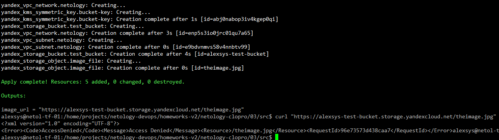
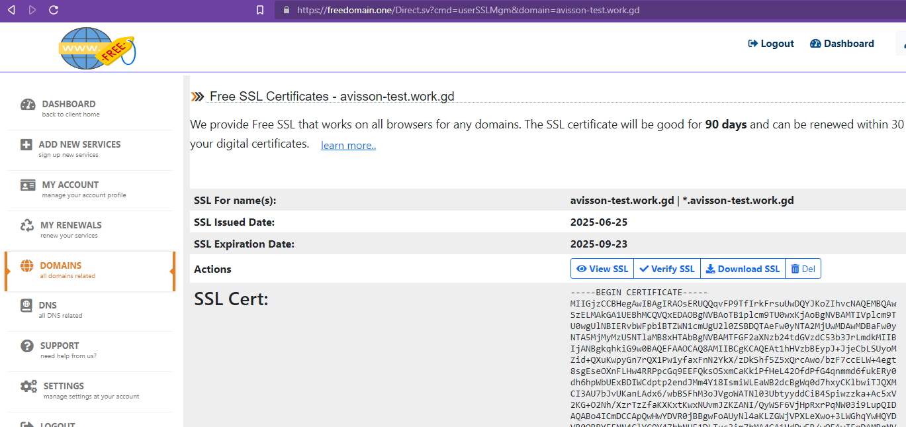
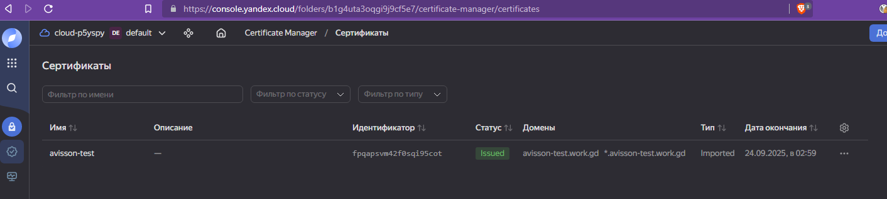
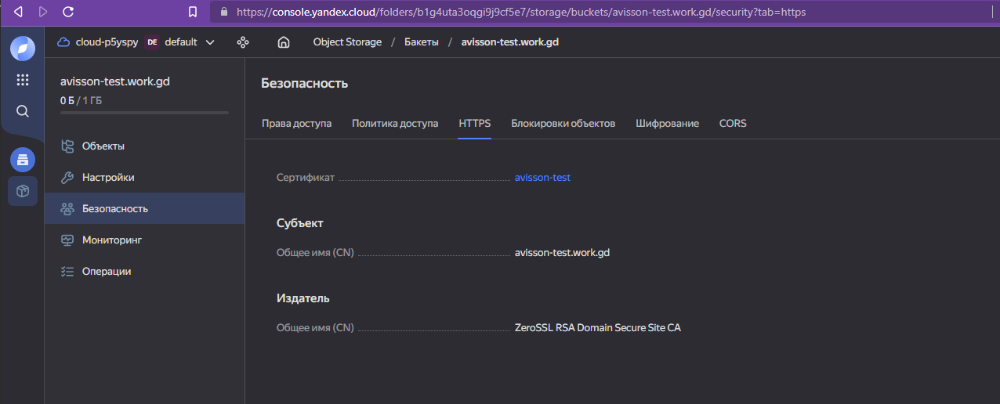
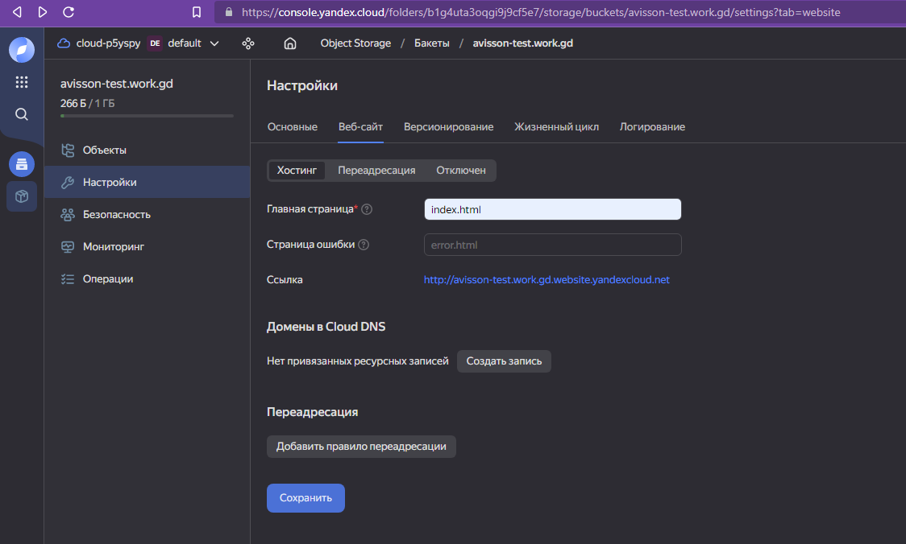
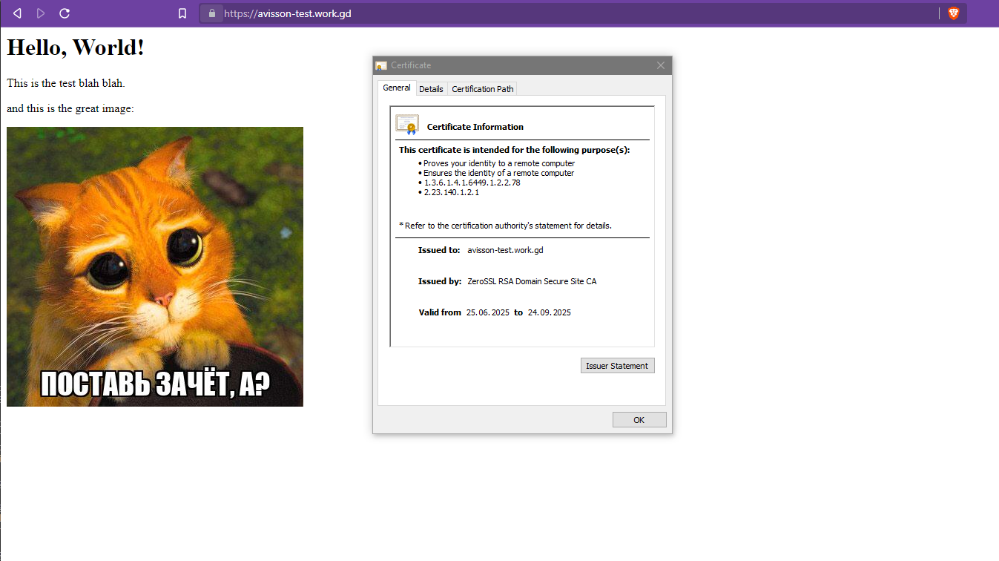

# 03. Безопасность в облачных провайдерах

### 1. Создаём ключ KMS:

```terraform
resource "yandex_kms_symmetric_key" "bucket-key" {
  name              = "bucket-key"
  default_algorithm = "AES_256"
}
```

### 2. Создаём bucket с включенным шифрованием и ресурс для файла:
```terraform
resource "yandex_storage_bucket" "test_bucket" {
  bucket = var.s3_bucket_name
  folder_id = var.folder_id
  anonymous_access_flags {
    read = var.s3_anon_read
    list = var.s3_anon_list
  }
  server_side_encryption_configuration {
    rule {
      apply_server_side_encryption_by_default {
        kms_master_key_id = yandex_kms_symmetric_key.bucket-key.id
        sse_algorithm     = "aws:kms"
      }
    }
  }
}

resource "yandex_storage_object" "image_file" {
  depends_on = [yandex_storage_bucket.test_bucket]
  bucket = var.s3_bucket_name
  key    = var.s3_file_key
  source = var.s3_file_path

}
```

Проверяем:



### 2. Создаём статический сайт

Выполнение задания подразумевает наличие свободного домена под управлением. У нас такого нет.
Поэтому, воспользуемся бесплатным доменом с [freedomain.one](https://freedomain.one/).
Зарегистрируем домен avisson-test.work.gd и там же выпустим для него сертификат.



Скачиваем файлы и добавляем сертифакат в Certificate Manager YC:



Создаём бакет с именем, равным домену, и добавляем туда файл [index.html](src/res/index.html) и нашу вошебную картинку. 

Включаем в настройках SSL:



Включаем хостинг сайта:



А дальше для ускорения процесса добавляем в локальный файл `hosts` наш домен и ip-адрес сервера яндекс, 
полученный по домену `avisson-test.work.gd.website.yandexcloud.net` :

`213.180.193.247 avisson-test.work.gd`

Проверяем:



Иного способа выполнения не придумалось.