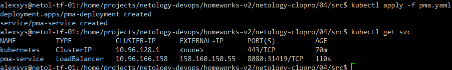

# 04. Кластеры. Ресурсы под управлением облачных провайдеров

### 1. 
Создаём публичные и приватные [сети](src/network.tf): 

```terraform
resource "yandex_vpc_network" "netology" {
  name = var.vpc_name
}
# Public subnets
resource "yandex_vpc_subnet" "public-networks" {
  for_each       = var.pub_net_options
  name           = "${var.pub_name_prefix}${each.key}"
  zone           = each.value.zone
  network_id     = yandex_vpc_network.netology.id
  v4_cidr_blocks = each.value.v4_cidr_blocks
}

# Private subnets
resource "yandex_vpc_subnet" "private-networks" {
  for_each       = var.pvt_net_options
  name           = "${var.pvt_name_prefix}${each.key}"
  zone           = each.value.zone
  network_id     = yandex_vpc_network.netology.id
  v4_cidr_blocks = each.value.v4_cidr_blocks
}
```
Проверяем:


### 2. 
Создаём [кластер](src/db.tf) Mysql, пользователя и БД. 
        
Проверяем:


Хосты:


База:


### 3. Кластер kubernetes
[Создаём](src/security.tf) ключ шифрования, сервисный аккаунт и добавляем его в необходимые роли:

```terraform
resource "yandex_kms_symmetric_key" "k8s-key" {
  name              = var.k8s_key_options.name
  description       = var.k8s_key_options.description
  default_algorithm = var.k8s_key_options.default_algorithm
  rotation_period   = var.k8s_key_options.rotation_period
}

resource "yandex_iam_service_account" "k8s-sa" {
  name        = var.k8s_sa_options.name
  description = var.k8s_sa_options.description
}

resource "yandex_resourcemanager_folder_iam_member" "k8s-sa-roles" {
  for_each  = toset(var.k8s_sa_options.roles)
  folder_id = var.folder_id
  role      = each.key
  member    = "serviceAccount:${yandex_iam_service_account.k8s-sa.id}"
}
```

Создаём [кластер](src/k8s.tf) и группу нод.

Проверяем:


Подключаемся к kubectl:


Создаём [deployment](src/pma.yaml) с приложением phpMyAdmin.



Подключаемся:


Файлы конфигурации расположены в каталоге [src](src/)

